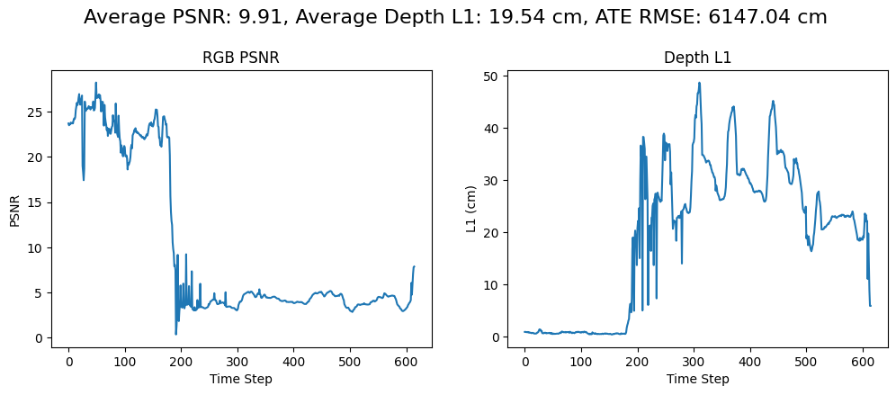
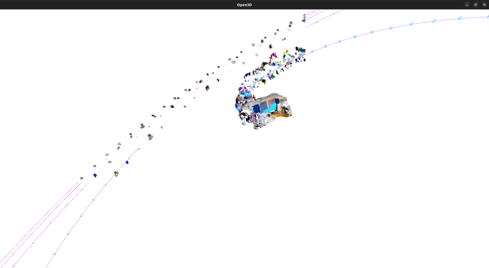
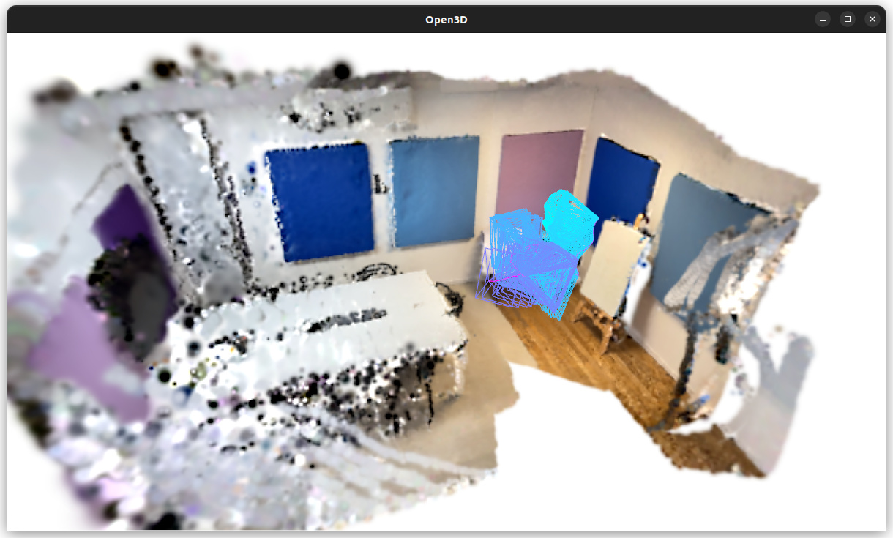
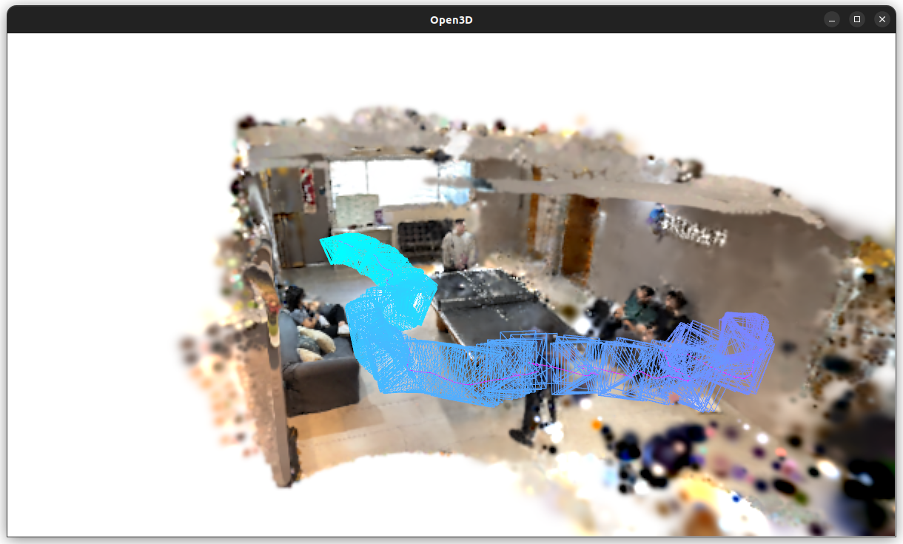

# 3D Mapping Workflow (Frodo)

# Recording devices

List of the recording devices used during the Frodo

* iPhone Pro  
  * Has lidar, which allows depth dataset recording.  
* iPhone  
  * No lidar, no depth capture.  
* Android device  
  * ARCore should suffice for the missing lidar, but there was no depth dataset saved after recording.  
  * So no depth capture.

# Recording tools

## NeRF Capture

* Only available for IOS.  
* Provides 2 different recording modes:  
  * Online mode & offline mode.

### Online mode

Requires the host to be connected into the recording device, so as to process the input while it is being captured.

### Offline mode

Saves a directory with the RBG captured frames and the depth frames \+ a transform.json file to feed into the processing tool.  
Offline mode is currently bugged. There is an issue with the recording processing, which is not converting the depth buffer correctly into 16 bit numbers. See [this author comment](https://github.com/jc211/NeRFCapture/issues/10#issuecomment-1888164311) for more details.

## Spectacular AI

* Available for both Android and IOS.  
* IOS’ version provides significantly less configuration options than Android’s.  
  * But Android devices don’t generate depth dataset.

Recording should be taken by moving through a room while pointing the device towards the walls, and occasionally performing a panoramic view of the room to capture objects that are centered or away from the walls. The open3d capture from the ping pong table shows a good example of a trajectory the recorder should follow.

# Processing tools

## SplaTAM

### Spectacular AI dataset

In order to run SplaTAM with Spectacular AI recorded data, the first step was to process it to match the output format of NeRF Capture.

### NeRF Capture dataset

To get the results, SplaTAM provides the [nerfcapture2dataset](https://github.com/ekumenlabs/SplaTAM/blob/main/scripts/nerfcapture2dataset.py) script to process the NeRF Capture output into the expected directory structure.
This script was modified to work with the Offline mode, by allowing to load a previously recorded dataset 

After running [splatam](https://github.com/ekumenlabs/SplaTAM/blob/main/scripts/splatam.py) algorithm, the output is saved into an params.npz file format that can then be visualized with open3d viewer to get ahold of the desired point cloud, alongside a metrics plot showing the PSNR and the captured depth of each frame, and additionally, each output frame rasterized.
See [NpzFile](https://numpy.org/devdocs/reference/generated/numpy.lib.npyio.NpzFile.html#numpy.lib.npyio.NpzFile) for info on `npz` format and how to load it.

### Results

First Spectacular AI results show metrics plots that look good on the first third of the processed frames, but derailed on the rest. This behavior was repeated throughout 3 captured datasets with an iPhone 14 pro.    

This leads to the rasterized images and the point cloud visualization to look awful, since the tracking of the capturing device’s position is not correct.

Changing the amount of frames to be processed to the point where the PSNR drops shows a much better result. It can be seen how the device tracker is within the captured environment.  

## Instant NGP

\[TODO\]

